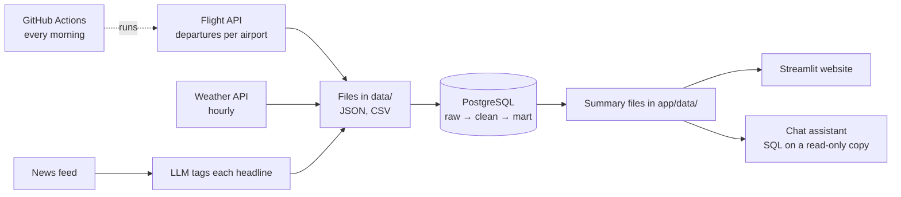

# DelayLens: AI Flight Delay Analyst for Indian Airports

**See why flights run late.** DelayLens tracks every departure from Mumbai, Bengaluru and Hyderabad against its schedule, joins each flight to the weather at that hour, to the same aircraft's previous flight and to the day's news, and lets you search, compare and ask questions in plain English. A scheduled job adds a new day of data every morning.

**Stack:** Python · SQL · PostgreSQL · Streamlit · Plotly · Google Gemini · GitHub Actions

---

## What the site does

| Page | What you can do |
|---|---|
| Ask DelayLens | Ask a question in English. The AI plans SQL queries over flights, weather and news, and shows its working |
| Search a flight | Type a flight number, city or airline. See that flight's track record, day by day, and the evidence for a late day |
| Departure board | Every departure of an airport on a day: scheduled time, actual take-off, status, weather |
| Airlines & airports | Punctuality by airline, airport and route |
| When delays happen | Delay risk by hour, and the knock-on effect of a late incoming aircraft |
| Weather impact | Late rate under each kind of weather |
| Daily log & news | Each day's numbers beside the weather, and disruption headlines sorted by an AI model |

## How it works



1. **Collect.** One API call returns the departures of one airport for a 12-hour window, with scheduled and actual times. The complete answer is saved as a file, so nothing is fetched twice. Hourly weather comes from Open-Meteo, headlines from a public news feed.
2. **Rebuild.** The database is rebuilt from those files on every run, so the result is the same on a laptop and in the scheduled job.
3. **Model in SQL.** The JSON answers become one row per flight; each flight is joined to the weather in its departure hour, and to the previous flight of the same aircraft with a window function (`LAG` over the aircraft registration).
4. **Publish.** Summary tables are written as small CSV files that the website reads, so the site needs no database server.

## AI in the project

**News tagging.** A search for "flights delayed" returns many unrelated aviation stories. An LLM reads each headline and decides whether it reports a real disruption, which airport it concerns and what the cause was, choosing from a fixed list. In the first week it kept 43 of 187 headlines.

**Chat assistant.** For each question the LLM writes up to three SQL queries (for a "why" question typically the day's flights, the day's weather and the day's news). Then:

- every query is parsed and must be a single read-only `SELECT` on known tables; anything else is refused,
- queries run on an in-memory copy of the data opened in query-only mode,
- the answer is written from the result rows only,
- every number in the answer is looked up in the results, and the page shows how many were verified.

The LLM never calculates or recalls a number; it writes queries and words the answer.

## Definitions and limits

- **Late** means the aircraft took off 30 or more minutes after its scheduled departure. The data gives take-off time, and a normal flight takes off 15 to 20 minutes after schedule because of push-back and taxi.
- **Coverage.** Actual times are recorded for about 90% of departures at Mumbai and Hyderabad and about 70% at Bengaluru. Flights without one are shown as "no actual time" and left out of rates.
- **Delhi is not included**: the data source returns schedules for Delhi but no actual departure times.
- **No official cause exists.** India does not publish a cause for each delayed flight, so the site shows evidence (weather, the aircraft's previous flight, how the whole airport did, the news) and does not claim a confirmed cause.
- **The data starts in October 2026 and grows by one day at a time.** Early figures rest on few days; weather comparisons in particular need bad-weather days to accumulate.
- **Free-tier budget.** The flight API's free plan allows about 200 calls a month, which is what limits the project to three airports updated once a day.

## Run it

Requirements: Python 3.11+, PostgreSQL 14+.

```bash
python -m venv .venv && source .venv/bin/activate
pip install -r requirements.txt
cp .env.example .env            # fill in DATABASE_URL and the two API keys
createdb flight_delays
python run_pipeline.py          # collect new data and rebuild everything
streamlit run app/site.py       # the website
```

`python run_pipeline.py --no-collect` rebuilds from the files already in `data/` without calling any API. The website alone needs only `pip install -r app/requirements.txt`.

## Project structure

```
├── run_pipeline.py              one command: collect, rebuild, publish
├── .github/workflows/           the daily scheduled job
├── data/
│   ├── api_calls/               saved API answers and the ledger of calls
│   ├── weather/, news/          hourly weather, headlines and their tags
│   └── reference/airports.csv
├── sql/                         raw schema, clean layer, mart, summary tables
├── src/                         collectors, loader, exporter, LLM helpers
└── app/                         the Streamlit website and its data files
```

## Data sources

Flight data: [AeroDataBox](https://aerodatabox.com). Weather: [Open-Meteo](https://open-meteo.com). News headlines: Google News RSS (headline, source and link only).
